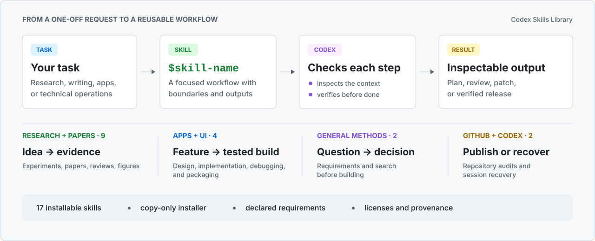

<p align="center">
  
</p>

<h1 align="center">Codex Skills Library</h1>

<p align="center">
  Installable workflows that help Codex turn research ideas, paper drafts, and software projects into work you can inspect and continue.
</p>

<p align="center">
  <a href="README.zh-CN.md">简体中文</a> ·
  <a href="docs/SKILL_CATALOG.md">Skill catalog</a> ·
  <a href="docs/INSTALL.md">Installation</a> ·
  <a href="CONTRIBUTING.md">Contributing</a>
</p>

<p align="center">
  <a href="https://github.com/sidiangongyuan/codex-skills-library/actions/workflows/quality.yml"></a>
</p>

<p align="center">
  <a href="assets/readme-overview.svg"></a>
</p>

Codex Skills Library collects 17 installable workflows distilled from repeated
research and engineering work. A skill is closer to a lightweight SOP than a
prompt: it tells Codex what to inspect, which checkpoints matter, what artifact
to leave behind, and when to stop for a human decision.

Use one skill for a focused job or compose several across a longer project.
Each installable directory keeps its instructions, declared requirements,
license, and provenance together.

_Independent community project; not affiliated with or endorsed by OpenAI._

## Start with one skill

Codex includes the `$skill-installer` system skill. Give it the GitHub URL of an
individual skill directory:

```text
$skill-installer Install https://github.com/sidiangongyuan/codex-skills-library/tree/main/skills/experiment-planner
```

On the next turn, try a concrete request:

```text
$experiment-planner Turn my image-classification course project into a one-day pilot with baselines, metrics, resource assumptions, and a stop/go decision.
```

A useful result should contain a falsifiable claim, comparisons, the smallest
pilot, expected signals, and a decision gate, not just a longer brainstorm.
The [worked example](docs/EXAMPLE_EXPERIMENT_PLAN.md) shows the shape of that
artifact without pretending that unrun experiments produced results.

There is no need to install all 17 skills. Replace `experiment-planner` with any
name in the [catalog](#browse-by-goal). The installed skill is available on the
next turn. Review its `SKILL.md`, `LICENSE`, requirements, and provenance before
using it in a sensitive environment. See the
[single-skill installation details](docs/INSTALL.md#install-one-skill-with-codex)
for private forks and command-line alternatives.

<details>
<summary><strong>Install several skills</strong></summary>

The repository installer supports selected or bulk installation and has no
runtime dependencies outside the Python standard library. It defaults to the
shared user-level directory `$HOME/.agents/skills`.

```bash
git clone https://github.com/sidiangongyuan/codex-skills-library.git
cd codex-skills-library
python scripts/install.py
python scripts/install.py --all --dry-run
python scripts/install.py --all
```

Running the installer without selection arguments only prints the catalog and
usage. `--all` is always explicit. To install a smaller set:

```bash
python scripts/install.py \
  --skill experiment-planner \
  --skill research-evidence \
  --skill paper-section-playbook \
  --dry-run

python scripts/install.py \
  --skill experiment-planner \
  --skill research-evidence \
  --skill paper-section-playbook
```

Existing skill directories are skipped by default. Use `--replace` only after
reviewing the dry run. Use `--target <directory>` to install elsewhere. The
[installation guide](docs/INSTALL.md) covers Windows paths, manual copying,
legacy `--codex-home` compatibility, and troubleshooting.

</details>

## Start from the work in front of you

- **Coursework or a capstone project**:
  `grill-me` &rarr; `search-first` &rarr; `app-feature-craft` turns a vague brief
  into a bounded project, checks existing tools, and carries the chosen path
  through implementation and verification.
- **A deep-learning research idea**:
  `grill-me` &rarr; `search-first` / `research-evidence` &rarr;
  `experiment-planner` separates the claim from the hunch, checks prior work,
  and ends with a pilot-first experiment matrix.
- **A paper before submission**:
  `paper-section-playbook` &rarr; `paper-refinement-skills` &rarr;
  `paper-review-panel` structures the argument, tightens it without inflating
  claims, and exposes decision-changing review risks.
- **Official reviews and rebuttal**:
  `rebuttal-response-skills` takes over only after reviews arrive, mapping exact
  concerns to evidence and reviewer-specific responses.
- **Figures, tables, and a research talk**:
  `paper-framework-figure-studio-pro` &rarr; `paper-visual-craft` &rarr;
  `paper-share-html` plans the visual story, refines the evidence, and prepares
  an audience-ready presentation.
- **An application or open-source release**:
  `app-feature-craft` &rarr; `app-bug-forensics` &rarr;
  `app-release-readiness` builds the feature, traces failures to root cause,
  and verifies what is actually shipped.

## Browse by goal

The concise table below is generated from [`skills.json`](skills.json).
Requirements, example prompts, licenses, and pinned source revisions remain in
the generated [full skill catalog](docs/SKILL_CATALOG.md).

<!-- skills-table:start -->

| Goal | Skill | Use it for |
|---|---|---|
| Research Ideation & Experiment Planning | [`experiment-planner`](skills/experiment-planner) | Plan deep-learning and computer-science research ideas as claim-driven, pilot-first experiment matrices. |
| Evidence & Search | [`research-evidence`](skills/research-evidence) | Search academic evidence, verify citation metadata, and check whether sources support research claims. |
| Evidence & Search | [`search-first`](skills/search-first) | Search for maintained tools, libraries, skills, research, and proven patterns before building a custom solution. |
| UI/UX & Product Design | [`ui-ux-pro-max`](skills/ui-ux-pro-max) | Design and review accessible web and mobile interfaces with a searchable UI/UX knowledge base. |
| App Development & Release | [`app-feature-craft`](skills/app-feature-craft) | Build product-grade app features across UX, frontend, backend, tests, and end-to-end verification. |
| App Development & Release | [`app-bug-forensics`](skills/app-bug-forensics) | Diagnose user-reported application failures from symptoms and logs through root cause and regression coverage. |
| App Development & Release | [`app-release-readiness`](skills/app-release-readiness) | Prepare, package, publish, and verify desktop or web application releases without shipping stale artifacts. |
| Research Ideation & Experiment Planning | [`grill-me`](skills/grill-me) | Interview a user one decision at a time to stress-test an underspecified plan or design. |
| Paper Writing | [`paper-section-playbook`](skills/paper-section-playbook) | Plan and restructure sections of computer-vision, 3D-perception, and autonomous-driving research papers. |
| Paper Writing | [`paper-refinement-skills`](skills/paper-refinement-skills) | Refine research-paper logic and prose while preserving verified claims, terminology, notation, and citation boundaries. |
| Paper Review & Readiness | [`paper-review-panel`](skills/paper-review-panel) | Independently review a paper before submission, synthesize top-conference concerns, and identify decision-changing readiness risks without editing the manuscript. |
| Rebuttal & Author Response | [`rebuttal-response-skills`](skills/rebuttal-response-skills) | Run an evidence-grounded rebuttal lifecycle from exact concern mapping and approved experiments through reviewer-specific responses and blind final audits. |
| Figures & Tables | [`paper-framework-figure-studio-pro`](skills/paper-framework-figure-studio-pro) | Plan source-grounded method, architecture, pipeline, system, and agent-workflow figures for CS and deep-learning papers. |
| Figures & Tables | [`paper-visual-craft`](skills/paper-visual-craft) | Design, redraw, and validate publication-ready research figures and tables while preserving exact evidence. |
| Paper Communication | [`paper-share-html`](skills/paper-share-html) | Create source-grounded, responsive paper presentations with readable PDF-extracted tables, varied explanatory diagrams, optional presenter-paced reveals, and live-talk browser QA. |
| Operations & Release | [`github-project-release`](skills/github-project-release) | Prepare a clean GitHub project repository with publication audits and controlled release workflows. |
| Operations & Release | [`codex-session-restore`](skills/codex-session-restore) | Diagnose and restore active Codex Desktop sidebar sessions after provider switches without changing authentication. |

<!-- skills-table:end -->

For example prompts, dependency notes, licenses, and pinned upstream revisions,
open the generated [full skill catalog](docs/SKILL_CATALOG.md). Attribution and
source treatment are recorded in [NOTICE.md](NOTICE.md).

## Use a skill

Explicit invocation is the clearest way to make a workflow reproducible:

```text
$app-bug-forensics Diagnose this intermittent provider timeout from the UI state through the request path. Report the root cause before changing code.
```

```text
$experiment-planner Turn this idea into a pilot-first experiment matrix with a falsifiable claim, baselines, diagnostics, and a stop/go gate.
```

Before submission, use the review panel to expose decision-changing paper risks:

```text
$paper-review-panel Review this draft before submission. Separate decision-changing evidence gaps from issues that can be fixed with writing.
```

After official reviews arrive, switch workflow owners:

```text
$rebuttal-response-skills Map these exact reviews, build the evidence ledger, draft reviewer-specific responses, and run the final blind audit.
```

All included skills also allow implicit invocation: Codex may select one when
its description closely matches the request. Explicit `$skill-name` invocation
is preferable when a particular workflow or a repeatable handoff matters.

Skills can be composed in sequence, but each stage keeps a clear owner. See
[workflow recipes](docs/USAGE.md) for complete examples and handoff points.

## Contribute

Contributions are welcome from any domain. A proposal issue is optional; a pull
request may add a useful skill directly. New skills must include:

- a focused `SKILL.md` with a matching lowercase kebab-case name;
- an example prompt and complete requirements in `skills.json`;
- an applicable license inside the installable skill directory;
- original-work or pinned-upstream provenance; and
- safe defaults for destructive, publishing, or externally visible actions.

Do not include credentials, private conversations, unpublished project
material, machine-specific paths, datasets, checkpoints, or redistribution
rights that are unclear. Read [CONTRIBUTING.md](CONTRIBUTING.md) for the template,
validation commands, and review criteria.

## License and safety

Original project material is licensed under the [MIT License](LICENSE).
Third-party material remains under its upstream license and copyright; every
installable skill carries the license text that applies to it. See
[NOTICE.md](NOTICE.md) for provenance labels and fixed source revisions.

Skills can influence tool use and may include executable helpers. The library
installer only copies files and never executes installed helpers, but users
should still inspect skills before granting them access to sensitive data,
credentials, publishing surfaces, or destructive tools. Report security issues
through the process in [SECURITY.md](SECURITY.md).
