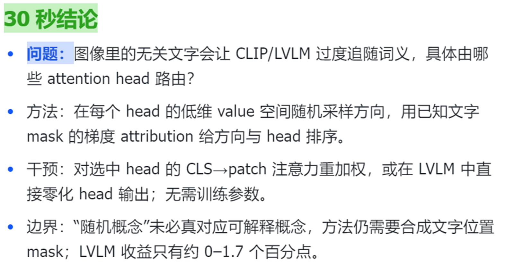
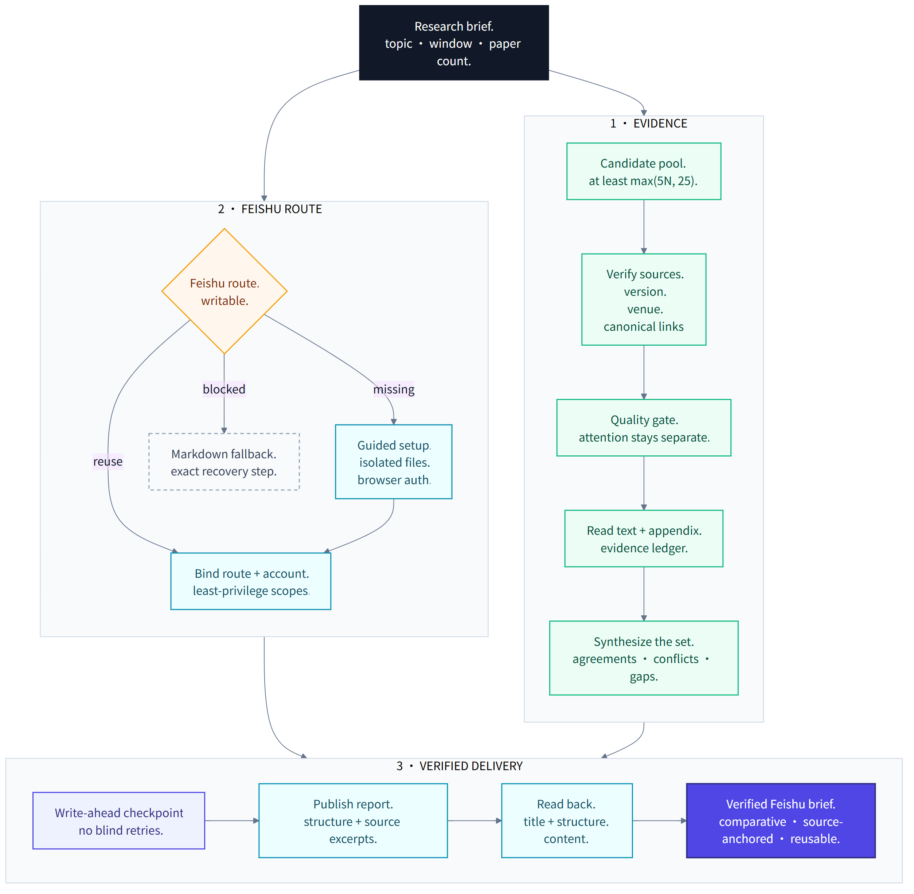
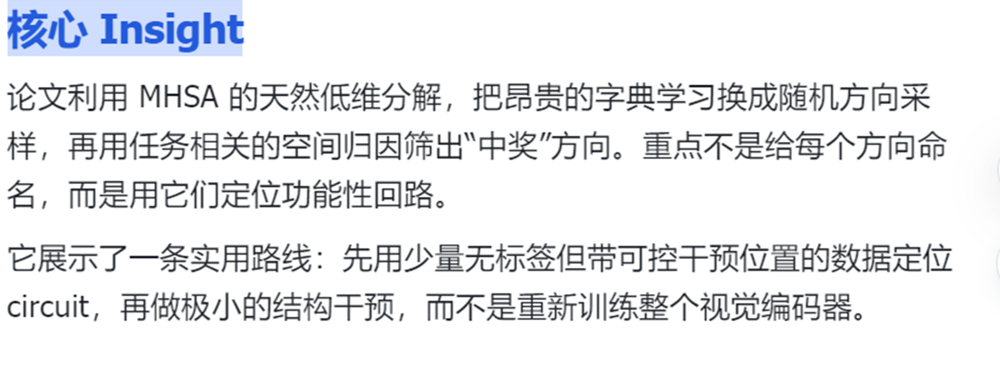

<p>
  <a href="../README.md">Codex Skills Library</a> ·
  <strong>English</strong> ·
  <a href="FEISHU_PAPER_READING.zh-CN.md">简体中文</a>
</p>

<h1 align="center">Feishu Paper Reading</h1>

<p align="center">
  Turn a research question into an evidence-grounded, read-back-verified Feishu
  brief, not a list of links.
</p>

<p align="center">
  <code>Broad retrieval</code> ·
  <code>Full-text evidence</code> ·
  <code>Original-language anchors</code> ·
  <code>Cross-paper synthesis</code> ·
  <code>Guided Feishu setup</code> ·
  <code>Verified delivery</code>
</p>

`feishu-paper-reading` is a reusable Codex workflow for finding, screening,
deeply reading, comparing, and organizing recent research. It preserves the
source wording needed for close reading, explains the material in the user's
preferred language, and treats Feishu publication as a delivery operation that
must be verified.

## Actual Result

<p align="center">
  <a href="../assets/feishu-paper-reading/actual-summary.png">
    
  </a>
</p>

<p align="center">
  <sub>
    An anonymized crop from an actual connector-backed Feishu delivery. Private
    account, tenant, document ID, and URL details are not shown. Open the image
    for the full-resolution view.
  </sub>
</p>

The result is designed for reading and decision-making. It leads with the
highest-value conclusions, then keeps the evidence, caveats, original wording,
and source locators close enough to inspect.

## What It Delivers

| Stage | What the skill does |
|---|---|
| Scope | Resolves the topic, absolute date window, paper count, quality/attention preference, output language, and destination. |
| Retrieval | Builds a broad, deduplicated candidate pool from primary literature sources, publisher metadata, official project pages, and code repositories. |
| Selection | Applies a technical-quality gate first, evaluates attention separately, records missing coverage, and does not present an abstract-only candidate as deeply read. |
| Deep reading | Reads the full paper and, when relevant, figures, tables, appendices, proofs, and supplementary material. |
| Evidence | Builds a claim ledger with results, locators, confidence, caveats, negative evidence, and short original-language excerpts followed by explanation. |
| Synthesis | Compares assumptions, representations, evidence, disagreements, blind spots, reproduction burden, research opportunities, and reading order across papers. |
| Delivery | Validates the report, checkpoints the write, forbids blind duplicate retries, reads the Feishu document back, and reports formatting or content downgrades instead of silently claiming success. |

Quality and observable attention remain separate signals. The workflow can use
current community activity for discovery, but popularity does not bypass the
technical-quality threshold.

## Workflow

<p align="center">
  <a href="../figures/feishu-paper-reading-workflow.png">
    
  </a>
</p>

The research path and the delivery path remain separate until the report is
ready. This matters: a connection problem cannot erase the research artifact,
and a successful API call cannot substitute for evidence quality.

## Evidence You Can Inspect

<p align="center">
  <a href="../assets/feishu-paper-reading/actual-insight.png">
    
  </a>
</p>

<p align="center">
  <sub>
    An anonymized crop from the same actual connector-backed Feishu delivery.
    The report content is retained; private account and document identifiers
    are excluded.
  </sub>
</p>

A complete digest normally contains:

- an executive summary and deliberate reading order;
- the search record, candidate counts, inclusion rules, and coverage gaps;
- a compact cross-paper comparison matrix;
- a verdict, method explanation, evidence ledger, source-language anchors,
  limitations, and reproduction notes for every selected paper;
- disagreements, shared assumptions, evaluation blind spots, and transferable
  ideas across the set; and
- prioritized research opportunities with a minimum experiment and failure
  signal.

## Feishu Delivery

The skill first reuses an already authorized compatible connector when one can
create a document and read that same document back. It does not reinstall or
reconfigure a healthy route.

For a first-time connection, the guided path is deliberately bounded:

1. Ask once for consent covering the named local and remote setup actions.
2. Inspect and, if needed, install a checksum-verified official `lark-cli`
   release without modifying `PATH`.
3. Create an isolated profile and configuration location rather than touching
   a shared default configuration.
4. Open the official browser flow for the authentication step that only the
   user can complete.
5. Request the minimum document scopes:
   `docx:document:create` and `docx:document:readonly`.
6. Confirm the intended route and account identity using non-secret
   fingerprints before publication.

An oversized report may need `docx:document:write_only` to continue writing to
the same document. That scope is requested only when disclosed in the initial
consent or after a fresh permission decision; it is never added silently.

The workflow never asks the user to paste an app secret, token, authorization
URL, or device code into chat. Guided setup is not zero-interaction: user
consent, browser authentication, tenant-side app approval, or a client restart
may still require the user.

### Checkpoint, Create, Then Read Back

Before the remote write, a publication checkpoint binds the validated report
payload to the selected route and identity. The workflow then starts one create
attempt. If the outcome is uncertain, it records that ambiguity and forbids a
blind retry. One audited retry can be unlocked only after the user confirms
that no matching document exists.

Delivery is complete only after the created document is fetched and checked for
representative content and structure, including its title, date window,
candidate and selected counts, paper sections, comparison content, evidence
anchors, and expected links or media fallbacks.

If setup is declined, the platform is incompatible, or verified delivery still
fails after bounded recovery, the complete Markdown report remains available.
The reason for the fallback is stated explicitly.

## Install

Codex includes the `$skill-installer` system skill:

```text
$skill-installer Install https://github.com/sidiangongyuan/codex-skills-library/tree/main/skills/feishu-paper-reading
```

The installed skill is available on the next turn. Explicit invocation is
required because this workflow can publish to an external system.

## Invoke

A quality-first recent-paper digest:

```text
$feishu-paper-reading Find the strongest five 3D spatial world-model papers from the last 30 days. Explain them in Chinese, preserve short original-language evidence with page, section, figure, or table anchors, compare the papers, propose a reading order and research opportunities, and publish the verified report to Feishu.
```

A more tightly specified brief:

```text
$feishu-paper-reading Search multimodal physical-world modeling from 2026-06-01 through 2026-07-15. Select six papers after a technical-quality gate, use observable attention only as a secondary signal, include full-text evidence and reproduction notes, write the report in English, and publish it to Feishu through the already verified account.
```

The topic, time window, paper count, venue constraints, selection balance,
reading depth, language, and destination can all be changed in the request.

## Guardrails

- It does not call a paper accepted without primary evidence.
- It does not convert missing evidence into a fabricated score.
- It does not quote beyond conservative source limits or omit source locators.
- It does not create a disposable probe document to test a connection.
- It does not repeat a remote create call merely because readback failed.
- It does not claim Feishu success until the written document has been read
  back and checked.

Readback verifies delivery and structure; it does not independently prove every
scientific claim. The report keeps author-reported results, Codex synthesis,
and uncertainty visibly distinct.

## Inspect the Workflow

- [Skill instructions](../skills/feishu-paper-reading/SKILL.md)
- [Evidence policy](../skills/feishu-paper-reading/references/evidence-policy.md)
- [Report schema](../skills/feishu-paper-reading/references/report-schema.md)
- [Feishu publishing rules](../skills/feishu-paper-reading/references/feishu-publishing.md)
- [First-time onboarding and recovery](../skills/feishu-paper-reading/references/feishu-onboarding.md)

The skill is an independent community workflow. Feishu and Lark are products of
their respective owners; this project is not affiliated with or endorsed by
them.
