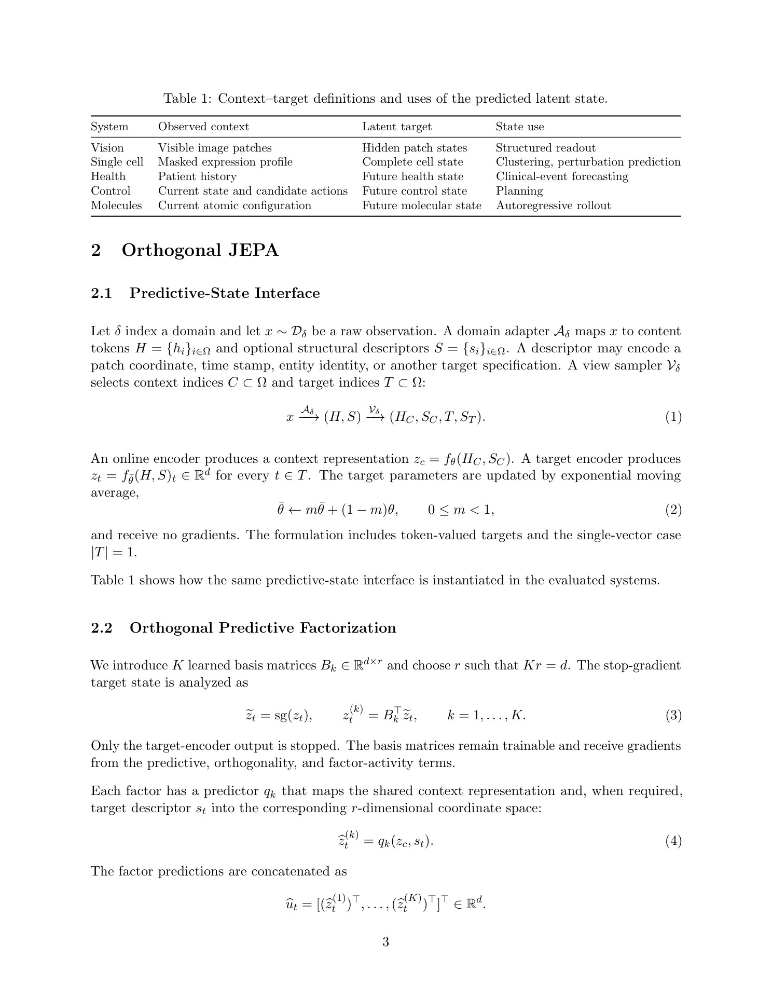

<p>
  <a href="../README.zh-CN.md">Codex Skills Library</a> ·
  <a href="FEISHU_PAPER_READING.md">English</a> ·
  <strong>简体中文</strong>
</p>

<h1 align="center">飞书论文深读</h1>

<p align="center">
  把一个研究问题变成有证据锚点、写入后回读核验的飞书阅读报告，而不是论文链接堆。
</p>

<p align="center">
  <code>广泛检索</code> ·
  <code>全文证据</code> ·
  <code>原文锚点</code> ·
  <code>跨论文综合</code> ·
  <code>飞书接入引导</code> ·
  <code>交付核验</code>
</p>

`feishu-paper-reading` 是一个可复用的 Codex 工作流，用于检索、筛选、深读、比较和
整理近期研究。它保留精读所需的原文措辞，用用户指定的语言解释内容，并把飞书发布
视为一项必须核验的交付操作。

## 实际成果

<p align="center">
  <a href="../assets/feishu-paper-reading/actual-summary.png">
    
  </a>
</p>

<p align="center">
  <sub>
    这是经 Connector 实际写入飞书后的匿名化裁剪截图。账号、租户、文档 ID 和 URL
    等私密信息均未展示；点击图片可查看清晰原图。
  </sub>
</p>

报告以阅读和决策为中心：先给出最有价值的结论，再把证据、限制、原文措辞和来源
定位放在方便核查的位置。

<p align="center">
  <a href="../assets/feishu-paper-reading/actual-issue3-source-figure.jpg">
    
  </a>
</p>

<p align="center"><sub>第三期示例：论文原文图表直接显示在飞书文档中，并保留图表标题与 PDF 定位。</sub></p>

## 它会交付什么

| 阶段 | Skill 的工作 |
|---|---|
| 任务边界 | 明确主题、绝对日期窗口、论文数量、质量与热度偏好、输出语言和交付位置。 |
| 候选检索 | 从论文主来源、出版方元数据、官方项目页和代码仓库建立较宽的候选池，并完成去重。 |
| 审慎筛选 | 先应用技术质量门槛，再单独评估热度；记录覆盖缺口，不把只读到摘要的候选称为“深读”。 |
| 全文阅读 | 阅读论文全文，并按需检查图、表、附录、证明和补充材料。 |
| 证据整理 | 建立包含结果、定位、置信度、限制和负面证据的 ledger；保留原文短句并紧接中文解释。 |
| 跨论文综合 | 比较假设、表征、证据、冲突、评测盲区、复现成本、研究机会和阅读顺序。 |
| 飞书交付 | 先验证报告并记录写前检查点；需要图表时通过 DOCX 直接嵌入原文视觉；禁止盲目重复创建，再回读飞书文档并报告降级。 |

技术质量和可观察热度始终是两个独立信号。工作流可以使用近期社区活动发现候选，但
热度不能绕过技术质量门槛。

## 工作流程

<p align="center">
  <a href="../figures/feishu-paper-reading-workflow.png">
    
  </a>
</p>

研究路径和交付路径会一直分开，直到报告准备完成。这样，连接问题不会让研究成果
消失，一次成功的 API 调用也不会被误当成高质量的文献证据。

### 固定阅读模板

每一期使用固定的语义配色：蓝色表示结论和标题，绿色表示优势与可迁移洞见，紫色表示
原文证据，橙色表示热度与公开资源，红色表示限制与失败模式，灰色表示元数据与核验。
用户要求图表时，必须把论文原文图表直接嵌入飞书，而不是只写“见论文图 2”。如果
Markdown 只留下标题而没有媒体块，不视为交付成功。

## 可以核查的证据

<p align="center">
  <a href="../assets/feishu-paper-reading/actual-insight.png">
    
  </a>
</p>

<p align="center">
  <sub>
    这是同一次 Connector 实际飞书交付的匿名化裁剪截图。报告正文得到保留，账号与
    文档标识均被排除。
  </sub>
</p>

一份完整的文献整理通常包括：

- 执行摘要和经过设计的阅读顺序；
- 检索记录、候选数量、纳入规则和覆盖缺口；
- 紧凑的跨论文比较矩阵；
- 每篇论文的快速判断、方法解释、证据 ledger、原文锚点、限制和复现说明；
- 论文之间的冲突、共同假设、评测盲区和可迁移思路；
- 按价值和可行性排序的研究机会，以及最小实验与失败信号。

报告使用文章叙述方式，不写面向读者的对话式提醒或元话语；不确定性、假设和范围直接
写入论文分析的证据与局限部分。

## 飞书交付

当已有兼容 Connector 可以创建文档并回读同一文档时，skill 会优先复用它，不会
重新安装工具或修改一条健康的连接。

首次连接采用边界明确的引导流程：

1. 先就明确列出的本地和远端设置动作征求一次同意。
2. 检查并按需安装经过校验和验证的官方 `lark-cli`，且不修改 `PATH`。
3. 创建隔离的 profile 和配置位置，不接触共享默认配置。
4. 打开官方浏览器认证流程，由用户完成只能由本人执行的验证。
5. 只请求文档所需的最小权限：
   `docx:document:create` 和 `docx:document:readonly`。
6. 发布前使用非秘密指纹确认目标连接和账号身份。

超长报告若需继续写入同一文档，可能还要使用 `docx:document:write_only`。只有在
首次同意中已经说明，或重新进行一次权限决策后才会申请；不会静默扩大权限。

工作流不会要求用户把 App Secret、Token、授权 URL 或设备码粘贴到聊天里。引导式
接入并不等于完全零交互：用户同意、浏览器认证、租户侧应用审批或客户端重启仍可能
需要用户参与。

### 先设检查点，再创建并回读

远端写入前，publication checkpoint 会把已经验证的报告内容与选定连接和身份绑定。
随后工作流发起一次创建尝试。如果结果状态不确定，它会记录歧义并禁止盲目重试。
只有用户确认近期文档中不存在匹配结果后，才允许解锁一次经过审计的重试。

只有在重新读取文档并检查代表性内容与结构后，交付才算完成。核验内容包括标题、
日期窗口、候选与入选数量、论文分节、比较内容、证据锚点，以及预期链接或媒体降级
说明；如果 Connector 支持 block inspection，还要核对预期的图片/文件数量，而不是只看
文字回读。

如果用户拒绝接入、平台不兼容，或经过有限恢复后仍无法完成可验证交付，完整
Markdown 报告仍会保留，并明确说明降级原因。

## 安装

Codex 自带 `$skill-installer` 系统 skill：

```text
$skill-installer 安装 https://github.com/sidiangongyuan/codex-skills-library/tree/main/skills/feishu-paper-reading
```

安装完成后会在下一轮对话中可用。由于此工作流可以向外部系统发布内容，调用时需要
显式写出 skill 名称。

## 调用

以技术质量优先整理近期论文：

```text
$feishu-paper-reading 搜索最近 30 天最值得阅读的 5 篇 3D 空间世界模型论文。用中文解释，保留带页码、章节、图或表定位的英文原文短句，比较论文之间的联系与冲突，给出阅读顺序和研究机会，并将核验后的报告发布到飞书。
```

给出更严格的任务边界：

```text
$feishu-paper-reading 搜索 2026-06-01 至 2026-07-15 期间的多模态物理世界建模研究。通过技术质量门槛后选出 6 篇，热度只作为次要信号；加入全文证据和复现说明，用中文整理，并通过已经验证的飞书账号发布。
```

主题、时间窗口、论文数量、venue 限制、质量与热度权衡、阅读深度、语言和交付位置
都可以在请求中调整。

## 边界与保护

- 没有主来源证据时，不会声称论文已经被接收。
- 不会把缺失证据转换成虚构的精确分数。
- 不会超出保守的原文引用范围，也不会省略来源定位。
- 不会为了测试连接而创建一次性探针文档。
- 不会因为回读失败就再次调用远端创建。
- 写入后的文档没有完成回读检查时，不会宣称飞书交付成功。

回读核验的是交付和结构，不是独立证明每一项科学主张。报告会明确区分作者报告的
结果、Codex 的综合判断和仍然存在的不确定性。

## 检查工作流

- [Skill 指令](../skills/feishu-paper-reading/SKILL.md)
- [证据策略](../skills/feishu-paper-reading/references/evidence-policy.md)
- [报告结构](../skills/feishu-paper-reading/references/report-schema.md)
- [飞书发布规则](../skills/feishu-paper-reading/references/feishu-publishing.md)
- [首次接入与恢复](../skills/feishu-paper-reading/references/feishu-onboarding.md)

本 skill 是社区维护的独立工作流。飞书和 Lark 属于其各自权利方，本项目与其没有
隶属关系，也未获得其背书。
