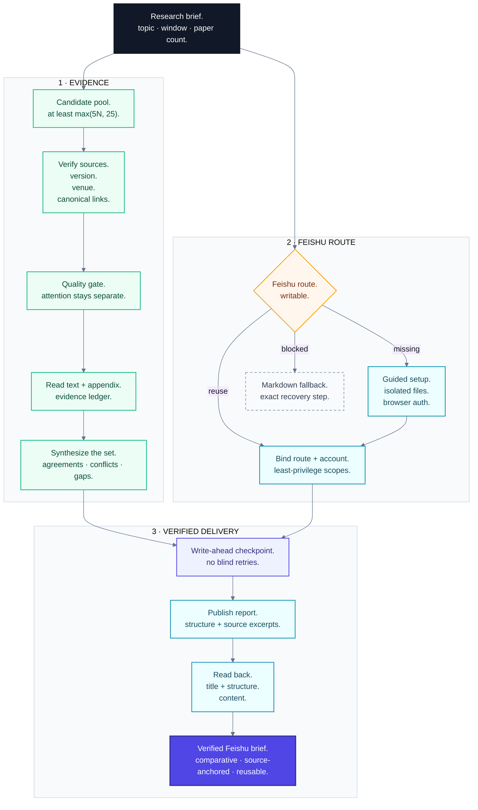

# Feishu paper-reading workflow

```mermaid
%%{init: {"theme": "base", "flowchart": {"htmlLabels": false, "curve": "basis"}, "themeVariables": {"fontFamily": "Arial, sans-serif", "lineColor": "#64748b", "primaryTextColor": "#111827", "clusterBkg": "#f8fafc", "clusterBorder": "#cbd5e1"}}}%%
flowchart TB
    brief["Research brief.<br/>topic · window · paper count."]

    subgraph evidence["1 · EVIDENCE"]
        direction TB
        pool["Candidate pool.<br/>at least max(5N, 25)."]
        verify["Verify sources.<br/>version.<br/>venue.<br/>canonical links."]
        gate["Quality gate.<br/>attention stays separate."]
        ledger["Read text + appendix.<br/>evidence ledger."]
        synth["Synthesize the set.<br/>agreements · conflicts · gaps."]
        pool --> verify --> gate --> ledger --> synth
    end

    subgraph delivery["2 · FEISHU ROUTE"]
        direction TB
        route{"Feishu route.<br/>writable."}
        bind["Bind route + account.<br/>least-privilege scopes."]
        setup["Guided setup.<br/>isolated files.<br/>browser auth."]
        fallback["Markdown fallback.<br/>exact recovery step."]
        route -->|"reuse"| bind
        route -->|"missing"| setup --> bind
        route -->|"blocked"| fallback
    end

    subgraph verified["3 · VERIFIED DELIVERY"]
        direction LR
        checkpoint["Write-ahead checkpoint.<br/>no blind retries."]
        publish["Publish report.<br/>structure + source excerpts."]
        readback["Read back.<br/>title + structure.<br/>content."]
        result["Verified Feishu brief.<br/>comparative · source-anchored · reusable."]
        checkpoint --> publish --> readback --> result
    end

    brief --> pool
    brief --> route
    synth --> checkpoint
    bind --> checkpoint

    classDef entry fill:#111827,stroke:#111827,color:#ffffff,stroke-width:2px;
    classDef research fill:#ecfdf5,stroke:#10b981,color:#064e3b,stroke-width:1.5px;
    classDef decision fill:#fff7ed,stroke:#f59e0b,color:#7c2d12,stroke-width:1.5px;
    classDef deliveryNode fill:#ecfeff,stroke:#0891b2,color:#164e63,stroke-width:1.5px;
    classDef checkpointNode fill:#eef2ff,stroke:#4f46e5,color:#312e81,stroke-width:1.5px;
    classDef output fill:#4f46e5,stroke:#312e81,color:#ffffff,stroke-width:2px;
    classDef fallbackNode fill:#f8fafc,stroke:#94a3b8,color:#334155,stroke-width:1.5px,stroke-dasharray:5 4;

    class brief entry;
    class pool,verify,gate,ledger,synth research;
    class route decision;
    class bind,setup,publish,readback deliveryNode;
    class checkpoint checkpointNode;
    class result output;
    class fallback fallbackNode;
```
